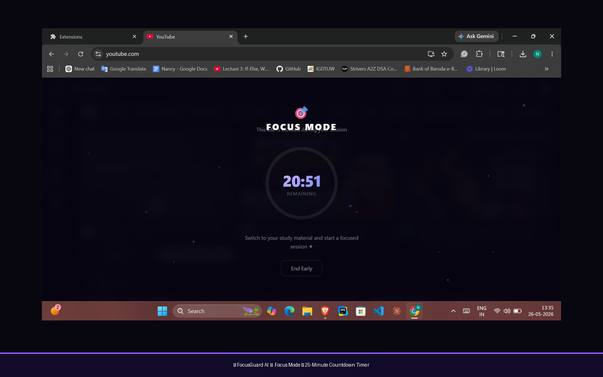
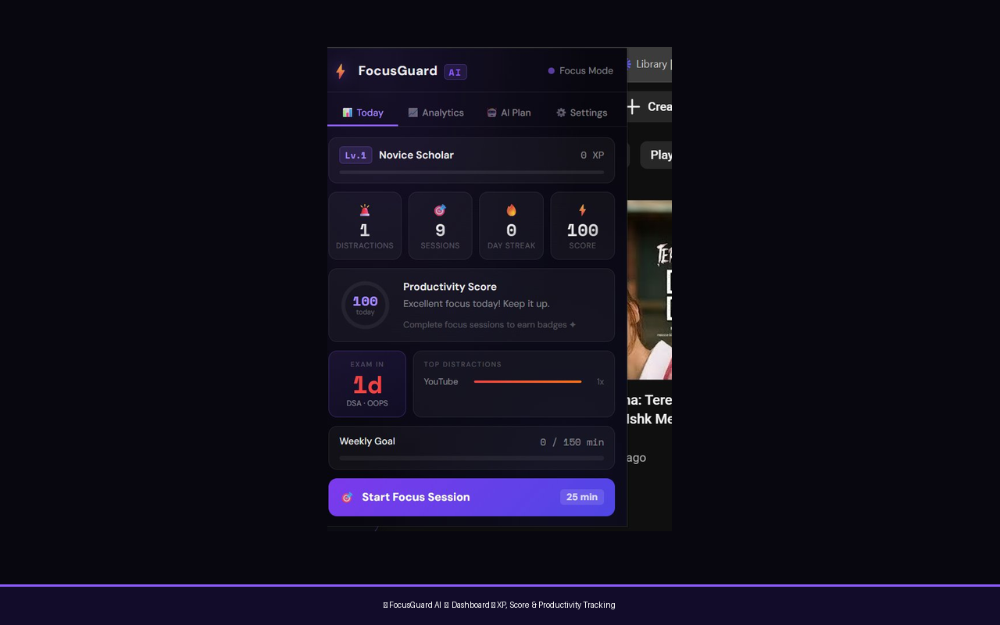
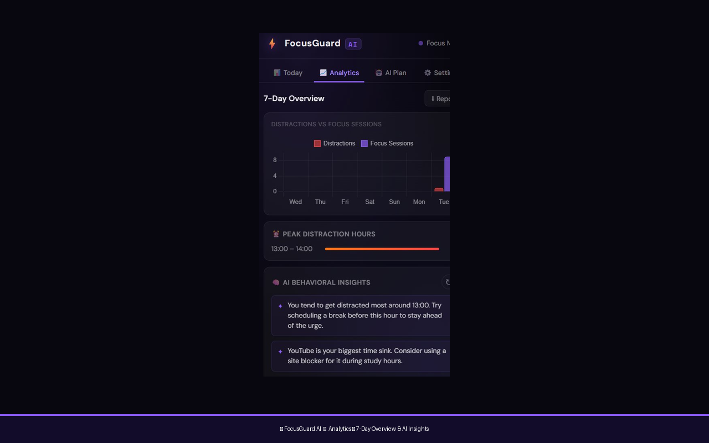
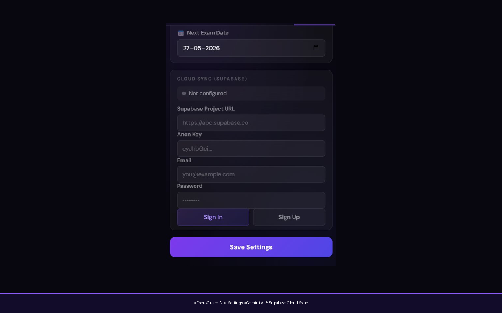

<div align="center">


# ⚡ FocusGuard AI

**Stop scrolling. Start studying.**

AI-powered distraction detection and focus analytics for students — built as a Chrome Extension with Google Gemini, Chart.js, and Supabase.

[](https://chromewebstore.google.com/detail/focusguard-ai/mmlfeichepnnjnofbcbbpodgkmbiieem)
[](https://developer.chrome.com/docs/extensions/mv3/)
[](https://ai.google.dev/)

[🚀 Install from Chrome Web Store](https://chromewebstore.google.com/detail/focusguard-ai/mmlfeichepnnjnofbcbbpodgkmbiieem)

</div>

---

## 📸 Screenshots

<div align="center">

| Focus Mode | Dashboard |
|:---:|:---:|
|  |  |

| Analytics | AI Modal |
|:---:|:---:|
|  |  |

</div>

---

## ✨ What It Does

- 🚨 **Detects distractions** on YouTube, Instagram, Reddit, Twitter, TikTok, Facebook
- 🧠 **AI study nudges** via Google Gemini — personalised to your subjects and exam date
- 🎓 **Skips educational YouTube** — CS lectures and NPTEL won't trigger alerts
- 🎯 **25-min Focus Mode** — full-screen countdown timer blocks the distracting site
- 📊 **Analytics dashboard** — 7-day trends, peak distraction hours, AI behavioural insights
- 🔥 **Gamification** — XP points, 10 levels, 9 badges, streaks, weekly goals
- ☁️ **Optional cloud sync** via Supabase — all data stays local by default

---

## 🚀 Setup

**1. Install the extension**
```
chrome://extensions → Developer Mode ON → Load unpacked → select this folder
```

**2. Get a free Gemini API key**
```
aistudio.google.com/app/apikey → Create API Key → copy it
```

**3. Configure**
```
Click ⚡ in toolbar → Settings → paste API key → add subjects → set exam date → Save
```

---

## 🛠️ Tech Stack

| Technology | Purpose |
|---|---|
| Chrome MV3 | Extension platform |
| Google Gemini 2.0 Flash | AI suggestions, YouTube classification, study planner |
| Chart.js 4 | 7-day analytics charts |
| Supabase (Postgres) | Optional cloud sync with Row-Level Security |
| chrome.storage.local | Local-first data storage |
| Vanilla JS + CSS | No framework — lightweight and fast |

---

## 🏗️ Architecture

```
focusguard-ai/
├── manifest.json     ← Permissions & config
├── background.js     ← Service worker orchestrator
├── ai.js             ← All Gemini AI calls
├── analytics.js      ← XP, streaks, scores, trends
├── sync.js           ← Supabase cloud sync
├── content.js        ← Injected into tracked websites
├── popup.html/js     ← 4-tab dashboard UI
└── styles.css        ← Dark glassmorphism design
```

---

## 👩‍💻 Built By

**Nancy** · B.Tech CSE · IGDTUW

⭐ Star this repo if FocusGuard helped you stay focused!

